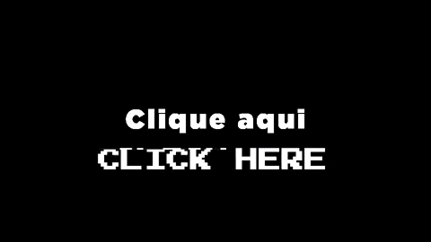

# Fly-by-Wire

**Fly-by-Wire** [ˌflaɪbaɪˈwaɪɹ], FBW, sinngemäß Fliegen per Kabel (elektrisch) oder elektronische Flugzeugsteuerung, ist
eine Signalübertragungstechnik für die Flugsteuerung von Luftfahrzeugen.

Im Unterschied zur klassischen Steuerung, bei der die Steuerbewegungen des Piloten mit dem Steuerhorn durch Stahlseile,
Schubstangen oder Hydrauliksysteme an die Steuerflächen oder Rotoren übertragen werden, sitzen bei Fly-by-Wire Sensoren
an den Steuerelementen (Steuerknüppel, Pedale usw.), deren elektrische Signale Aktoren (Elektromotoren, Hydraulik) an
den Steuerflächen ansteuern.

In der Regel wird vorausgesetzt, dass die per Draht übermittelten Steuerbefehle von einem Flugcomputer (Autopilot)
stammen. Hierdurch wird der Pilot zusätzlich unterstützt und von Routineaufgaben befreit.

(Quelle: [Wikipedia](https://de.wikipedia.org/wiki/Fly-by-Wire))

# Die Antwort auf die große Frage nach dem Leben, dem Universum und allem lautet...

# Du hast Zweifel und weißt nicht, was Du hier tun sollst...

Finde das richtige Bild und klicke darauf!

<table>
    <tr>
        <td></td>
        <td></td>
        <td></td>
        <td></td>
        <td></td>
        <td></td>
        <td></td>
        <td></td>
    </tr>
    <tr>
        <td></td>
        <td></td>
        <td></td>
        <td></td>
        <td></td>
        <td></td>
        <td></td>
        <td></td>
    </tr>
    <tr>
        <td></td>
        <td></td>
        <td></td>
        <td></td>
        <td></td>
        <td></td>
        <td></td>
        <td></td>
    </tr>
    <tr>
        <td></td>
        <td></td>
        <td></td>
        <td></td>
        <td></td>
        <td></td>
        <td></td>
        <td></td>
    </tr>
</table>

# Alles in einem Commit

